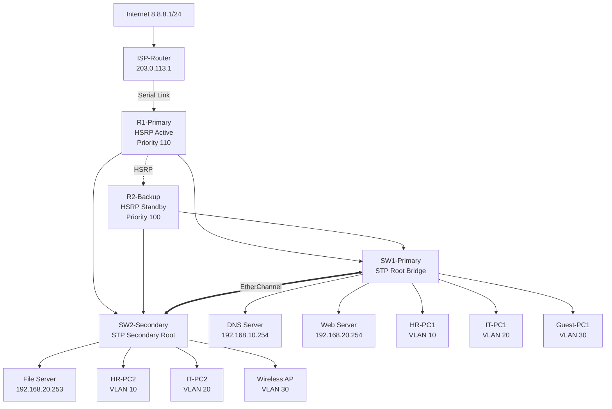

# 🌐 Advanced Enterprise VLAN Lab

## 📖 Tổng Quan

Đây là một lab mạng nâng cao mô phỏng môi trường doanh nghiệp thực tế với đầy đủ các tính năng High Availability, Security và Redundancy. Lab được thiết kế để học tập và thực hành các công nghệ mạng enterprise hiện đại.

## 🎯 Mục Tiêu Học Tập

- **VLAN & Trunking**: Phân đoạn mạng và inter-VLAN routing
- **High Availability**: HSRP cho router redundancy
- **Link Aggregation**: EtherChannel cho bandwidth và fault tolerance
- **Network Security**: Port Security, DHCP Snooping, ACLs
- **Wireless Networking**: Guest network với WPA2 security
- **WAN Connectivity**: NAT/PAT cho internet access
- **Network Services**: DHCP, DNS, Web, FTP servers
- **Network Monitoring**: SNMP, Syslog, NTP
- **Troubleshooting**: Systematic approach và problem solving

## 🏗️ Kiến Trúc Mạng

```
              [Internet Services]  
                     |
               [ISP-Router 2901]  
                 203.0.113.1
                     |
                Serial Link
                     |
[R1-2901]--------[R2-2901]  (HSRP Active/Standby)
192.168.x.2    192.168.x.3
    |              |
    |     EtherChannel (Po1)
    |        /         \
[SW1-3650]--------[SW2-3650]  (STP Root/Secondary)
    |                  |
  PCs/WAP          Servers
```

## 📋 Danh Sách Thiết Bị

### Routers
- **3x Cisco Router 2901**
  - R1-Primary (HSRP Active)
  - R2-Backup (HSRP Standby)
  - ISP-Router (Internet Simulation)

### Switches
- **2x Cisco Switch 3650**
  - SW1-Primary (STP Root Bridge)
  - SW2-Secondary (STP Secondary Root)

### Servers
- **DNS Server**: 192.168.10.254 (VLAN 10)
- **Web Server**: 192.168.20.254 (VLAN 20)
- **File Server**: 192.168.20.253 (VLAN 20)

### End Devices
- **6x PC**: HR và IT departments
- **1x Wireless Access Point**: Guest network
- **2x Laptop**: Wireless clients

## 🔧 Tính Năng Chính

### ✅ High Availability
- **HSRP** (Hot Standby Router Protocol) cho gateway redundancy
- **EtherChannel** cho link aggregation và fault tolerance
- **Spanning Tree** cho loop prevention

### ✅ Security Features
- **Port Security** với MAC address learning
- **DHCP Snooping** chống rogue DHCP servers
- **Dynamic ARP Inspection** chống ARP spoofing
- **Access Control Lists** phân quyền truy cập

### ✅ Network Services
- **DHCP** pools cho tất cả VLANs
- **DNS** resolution với local records
- **NAT/PAT** cho internet connectivity
- **Wireless** network với WPA2 security

### ✅ Monitoring & Management
- **SNMP** cho network monitoring
- **Syslog** cho centralized logging
- **NTP** cho time synchronization

## 🏷️ VLAN Design

| VLAN | Name | Network | Purpose | Devices |
|------|------|---------|---------|---------|
| 10 | HR-Department | 192.168.10.0/24 | HR users | HR-PCs, DNS Server |
| 20 | IT-Department | 192.168.20.0/24 | IT users | IT-PCs, Servers |
| 30 | Guest-Network | 192.168.30.0/24 | Guest access | Guest devices, WAP |

## 📊 IP Address Plan

### HSRP Virtual IPs
- **HR Gateway**: 192.168.10.1
- **IT Gateway**: 192.168.20.1
- **Guest Gateway**: 192.168.30.1
- **Management Gateway**: 192.168.99.1

### Router Physical IPs
- **R1**: .2 addresses (HSRP Active - Priority 110)
- **R2**: .3 addresses (HSRP Standby - Priority 100)

### WAN Connectivity
- **Customer WAN**: 203.0.113.2/30
- **ISP WAN**: 203.0.113.1/30
- **Internet Simulation**: 8.8.8.1/24

## 🚀 Quick Start

### 1. Chuẩn Bị Thiết Bị
```bash
# Danh sách thiết bị cần lắp
- 3x Router 2901 (R1, R2, ISP)
- 2x Switch 3650 (SW1, SW2)
- 3x Server (DNS, Web, File)
- 6x PC + 1x WAP + 2x Laptop
- 20x Straight-through cables
- 4x Cross-over cables
- 2x Serial DCE/DTE cables
```

### 2. Kết Nối Vật Lý
```bash
# Backbone connections
ISP-Router Se0/0/0 -----> R1 Se0/0/0
R1 Gi0/0 -----> SW1 Gi1/0/24 (trunk)
R1 Gi0/1 -----> SW2 Gi1/0/24 (trunk)
R2 Gi0/0 -----> SW1 Gi1/0/23 (trunk)
R2 Gi0/1 -----> SW2 Gi1/0/23 (trunk)

# EtherChannel between switches
SW1 Gi1/0/1-2 =====> SW2 Gi1/0/1-2
```

### 3. Cấu Hình Cơ Bản
```cisco
# Bật tất cả interfaces
Router(config)# interface range gi0/0-1
Router(config-if)# no shutdown

# Tạo VLANs trên switches
Switch(config)# vlan 10,20,30,99
```

## 📝 Hướng Dẫn Cấu Hình

### Router Configuration
```cisco
# R1 - Primary Router với HSRP Active
hostname R1-Primary
interface gi0/0.10
 encapsulation dot1Q 10
 ip address 192.168.10.2 255.255.255.0
 standby 10 ip 192.168.10.1
 standby 10 priority 110
 standby 10 preempt
```

### Switch Configuration
```cisco
# SW1 - Primary Switch
hostname SW1-Primary
spanning-tree vlan 10,20,30,99 root primary

# EtherChannel setup
interface range gi1/0/1-2
 channel-group 1 mode active
```

### Security Configuration
```cisco
# Port Security
interface gi1/0/10
 switchport port-security
 switchport port-security maximum 2
 switchport port-security mac-address sticky

# DHCP Snooping
ip dhcp snooping
ip dhcp snooping vlan 10,20,30
```

## 🧪 Testing & Verification

### Basic Connectivity Tests
```bash
# Test inter-VLAN routing
ping 192.168.10.1    # HR Gateway
ping 192.168.20.1    # IT Gateway
ping 192.168.30.1    # Guest Gateway

# Test DNS resolution
nslookup intranet.local
```

### HSRP Failover Test
```cisco
# Check HSRP status
show standby brief

# Simulate failure
R1(config)# interface gi0/0
R1(config-if)# shutdown

# Verify failover
show standby brief
```

### Security Tests
```bash
# Test ACL blocking
# From Guest PC, try to ping HR/IT networks
ping 192.168.10.10    # Should FAIL
ping 192.168.20.10    # Should FAIL
ping 8.8.8.1          # Should PASS
```

## 🔍 Troubleshooting

### Common Commands
```cisco
# Router troubleshooting
show ip route
show standby brief
show ip nat translations
show ip dhcp binding

# Switch troubleshooting
show vlan brief
show spanning-tree brief
show etherchannel summary
show port-security
```

### Common Issues
1. **HSRP not working** → Check authentication and priorities
2. **EtherChannel down** → Verify mode and VLAN configuration
3. **No DHCP** → Check pools and helper-address
4. **No Internet** → Verify NAT configuration and default route

## 📚 Tài Liệu Tham Khảo

### Cisco Documentation
- [HSRP Configuration Guide](https://www.cisco.com/c/en/us/td/docs/ios-xml/ios/ipapp_fhrp/configuration/xe-3s/fhp-xe-3s-book.html)
- [EtherChannel Configuration](https://www.cisco.com/c/en/us/td/docs/switches/lan/catalyst6500/ios/12-2SX/configuration/guide/book/spantree.html)
- [VLAN Configuration Guide](https://www.cisco.com/c/en/us/td/docs/switches/lan/catalyst6500/ios/12-2SX/configuration/guide/book/vlans.html)

### Learning Resources
- **Cisco Networking Academy** - CCNA courses
- **Packet Tracer** - Network simulation tool
- **GNS3** - Advanced network emulation

## 📊 Network Topology Diagram



## 📈 Performance Metrics

### Expected Throughput
- **EtherChannel**: 2 Gbps aggregate bandwidth
- **Inter-VLAN**: Line rate switching
- **WAN Link**: 64 Kbps (simulated)
- **Wireless**: 802.11n standards

### Convergence Times
- **HSRP Failover**: < 3 seconds
- **Spanning Tree**: < 30 seconds (Rapid PVST+)
- **EtherChannel**: < 1 second
- **DHCP Lease**: 86400 seconds (24 hours)

## 🏆 Achievement Badges

Hoàn thành các test cases để nhận badges:

- 🎯 **Network Architect**: Thiết kế topology hoàn chỉnh
- 🔧 **Configuration Master**: Cấu hình tất cả devices
- 🛡️ **Security Expert**: Implement tất cả security features
- 🔄 **Redundancy Pro**: Test tất cả failover scenarios
- 📊 **Monitoring Guru**: Setup SNMP và logging
- 🌐 **Connectivity Champion**: Test end-to-end connectivity

## 🙏 Acknowledgments

- **Cisco Systems** - Thiết bị và documentation
- **Packet Tracer Community** - Testing và feedback
- **Network Engineers** - Best practices và real-world scenarios
- **Students & Educators** - Continuous improvement suggestions

---

**⭐ Nếu project này hữu ích, hãy give star và share với community!**

---

## 📝 Changelog

### Version 2.0 (Current)
- ✅ Added HSRP high availability
- ✅ Implemented EtherChannel redundancy
- ✅ Enhanced security features
- ✅ Added wireless network support
- ✅ Included comprehensive monitoring

### Version 1.0
- ✅ Basic VLAN configuration
- ✅ Single router setup
- ✅ Simple connectivity

## 🔮 Roadmap

### Phase 2 (Q3 2024)
- [ ] IPv6 dual stack implementation
- [ ] QoS policies for voice/video
- [ ] VPN remote access
- [ ] Network automation scripts

### Phase 3 (Q4 2024)
- [ ] SD-WAN integration
- [ ] Network analytics dashboard
- [ ] Multi-site connectivity
- [ ] Cloud integration

---

*Được tạo với ❤️ bởi Senti*
